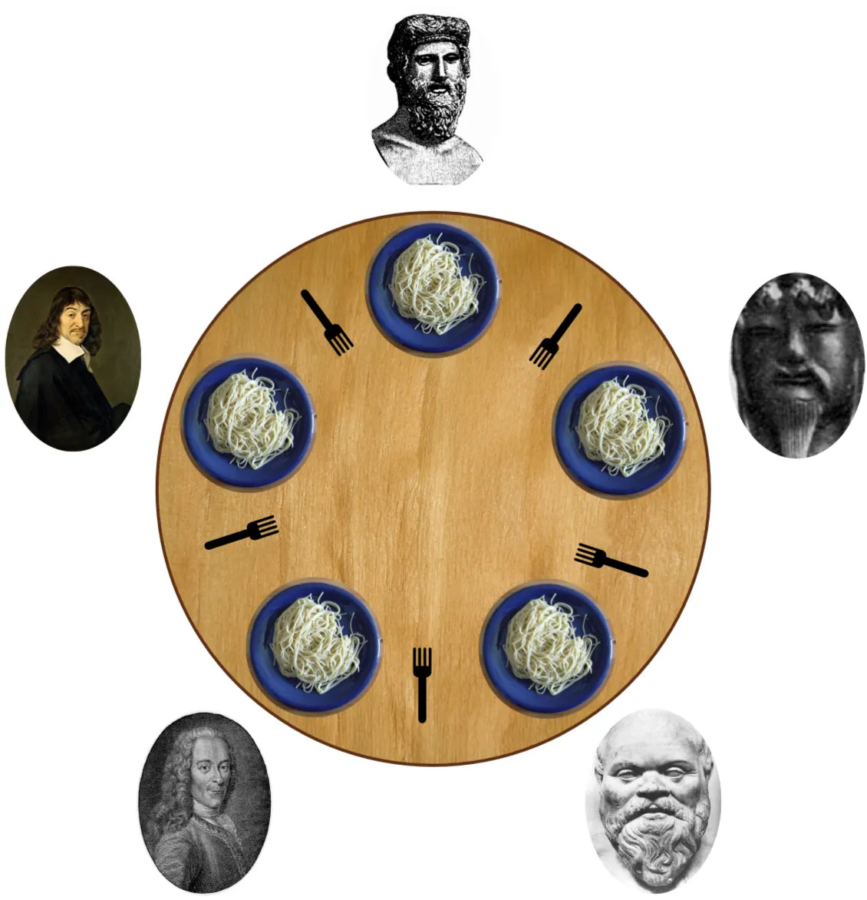

# Philosophers

This project is a classic synchronization problem, also known as the dining philosophers problem.



## The Project

The goal is to learn about threads, mutexes, and the challenges of concurrent programming. The project consists of two parts:

- **Mandatory Part:** Philosophers who eat, think, and sleep. They need to pick up two forks to eat. A philosopher dies if they don't eat within a certain time.
- **Bonus Part:** Same as the mandatory part, but using semaphores instead of mutexes.

## How to Use

### Mandatory Part

1.  **Compile:**
    ```bash
    make -C philo
    ```

2.  **Run:**
    ```bash
    ./philo/philo number_of_philosophers time_to_die time_to_eat time_to_sleep [number_of_times_each_philosopher_must_eat]
    ```

### Bonus Part

1.  **Compile:**
    ```bash
    make -C philo_bonus
    ```

2.  **Run:**
    ```bash
    ./philo_bonus/philo_bonus number_of_philosophers time_to_die time_to_eat time_to_sleep [number_of_times_each_philosopher_must_eat]
    ```

## Arguments

- `number_of_philosophers`: The number of philosophers and also the number of forks.
- `time_to_die` (in milliseconds): If a philosopher doesn’t start eating within this time, they die.
- `time_to_eat` (in milliseconds): The time it takes for a philosopher to eat.
- `time_to_sleep` (in milliseconds): The time it takes for a philosopher to sleep.
- `[number_of_times_each_philosopher_must_eat]` (optional): If all philosophers have eaten at least this many times, the simulation stops.
